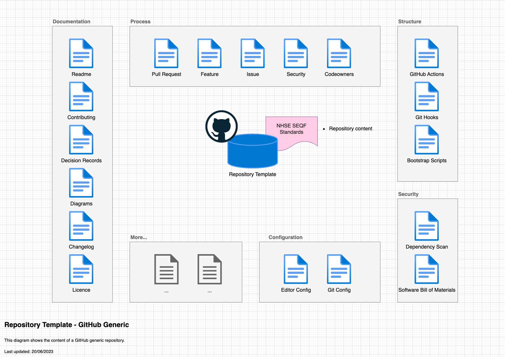

# Repository Template

[](https://github.com/nhs-england-tools/repository-template/actions/workflows/cicd-1-pull-request.yaml)
[](https://sonarcloud.io/summary/new_code?id=repository-template)

Start with an overview or a brief description of what the project is about and what it does. For example -

Welcome to our repository template designed to streamline your project setup! This robust template provides a reliable starting point for your new projects, covering an essential tech stack and encouraging best practices in documenting.

This repository template aims to foster a user-friendly development environment by ensuring that every included file is concise and adequately self-documented. By adhering to this standard, we can promote increased clarity and maintainability throughout your project's lifecycle. Bundled within this template are resources that pave the way for seamless repository creation. Currently supported technologies are:

- Terraform
- Docker

Make use of this repository template to expedite your project setup and enhance your productivity right from the get-go. Enjoy the advantage of having a well-structured, self-documented project that reduces overhead and increases focus on what truly matters - coding!

## Table of Contents

- [Repository Template](#repository-template)
  - [Table of Contents](#table-of-contents)
  - [Setup](#setup)
    - [Prerequisites](#prerequisites)
    - [Configuration](#configuration)
  - [Usage](#usage)
    - [Testing](#testing)
  - [Design](#design)
    - [Diagrams](#diagrams)
    - [Modularity](#modularity)
  - [Contributing](#contributing)
  - [Contacts](#contacts)
  - [Licence](#licence)

## Setup

By including preferably a one-liner or if necessary a set of clear CLI instructions we improve user experience. This should be a frictionless installation process that works on various operating systems (macOS, Linux, Windows WSL) and handles all the dependencies.

Clone the repository

```shell
git clone https://github.com/nhs-england-tools/repository-template.git
cd nhs-england-tools/repository-template
```

### Prerequisites

The following software packages, or their equivalents, are expected to be installed and configured:

- [docker](https://www.docker.com/) container runtime or a compatible tool, e.g. [podman](https://podman.io/),
- [asdf](https://asdf-vm.com/) version manager,
- [GNU make](https://www.gnu.org/software/make/) 3.82 or later,
- [GNU coreutils](https://www.gnu.org/software/coreutils/) and [GNU binutils](https://www.gnu.org/software/binutils/) may be required to build dependencies like Python, which may need to be compiled during installation. For macOS users, this has been scripted and automated by the `dotfiles` project; please see this [script](https://github.com/nhs-england-tools/dotfiles/blob/main/assets/20-install-base-packages.macos.sh) for details,
- [Python](https://www.python.org/) required to run Git hooks,
- [jq](https://jqlang.github.io/jq/) a lightweight and flexible command-line JSON processor.

> [!NOTE]<br>
> The version of GNU make available by default on macOS is earlier than 3.82. You will need to upgrade it or certain `make` tasks will fail. On macOS, you will need [homebrew](https://brew.sh/) installed, then to install `make`, like so:
>
> ```shell
> brew install make
> ```
>
> You will then see instructions to fix your `$PATH` variable to make the newly installed version available. If you are using [dotfiles](https://github.com/nhs-england-tools/dotfiles), this is all done for you.

### Configuration

Installation and configuration of the toolchain dependencies

```shell
make config
```

## Usage

After a successful installation, provide an informative example of how this project can be used. Additional code snippets, screenshots and demos work well in this space. You may also link to the other documentation resources, e.g. the [User Guide](./docs/user-guide.md) to demonstrate more use cases and to show more features.

### Testing

There are `make` tasks for you to configure to run your tests.  Run `make test` to see how they work.  You should be able to use the same entry points for local development as in your CI pipeline.

## Design

### Diagrams

The [C4 model](https://c4model.com/) is a simple and intuitive way to create software architecture diagrams that are clear, consistent, scalable and most importantly collaborative. This should result in documenting all the system interfaces, external dependencies and integration points.



### Modularity

Most of the projects are built with customisability and extendability in mind. At a minimum, this can be achieved by implementing service level configuration options and settings. The intention of this section is to show how this can be used. If the system processes data, you could mention here for example how the input is prepared for testing - anonymised, synthetic or live data.

## Contributing

Describe or link templates on how to raise an issue, feature request or make a contribution to the codebase. Reference the other documentation files, like

- Environment setup for contribution, i.e. `CONTRIBUTING.md`
- Coding standards, branching, linting, practices for development and testing
- Release process, versioning, changelog
- Backlog, board, roadmap, ways of working
- High-level requirements, guiding principles, decision records, etc.

## Contacts

Provide a way to contact the owners of this project. It can be a team, an individual or information on the means of getting in touch via active communication channels, e.g. opening a GitHub discussion, raising an issue, etc.

## Licence

> The [LICENCE.md](./LICENCE.md) file will need to be updated with the correct year and owner

Unless stated otherwise, the codebase is released under the MIT License. This covers both the codebase and any sample code in the documentation.

Any HTML or Markdown documentation is [© Crown Copyright](https://www.nationalarchives.gov.uk/information-management/re-using-public-sector-information/uk-government-licensing-framework/crown-copyright/) and available under the terms of the [Open Government Licence v3.0](https://www.nationalarchives.gov.uk/doc/open-government-licence/version/3/).
