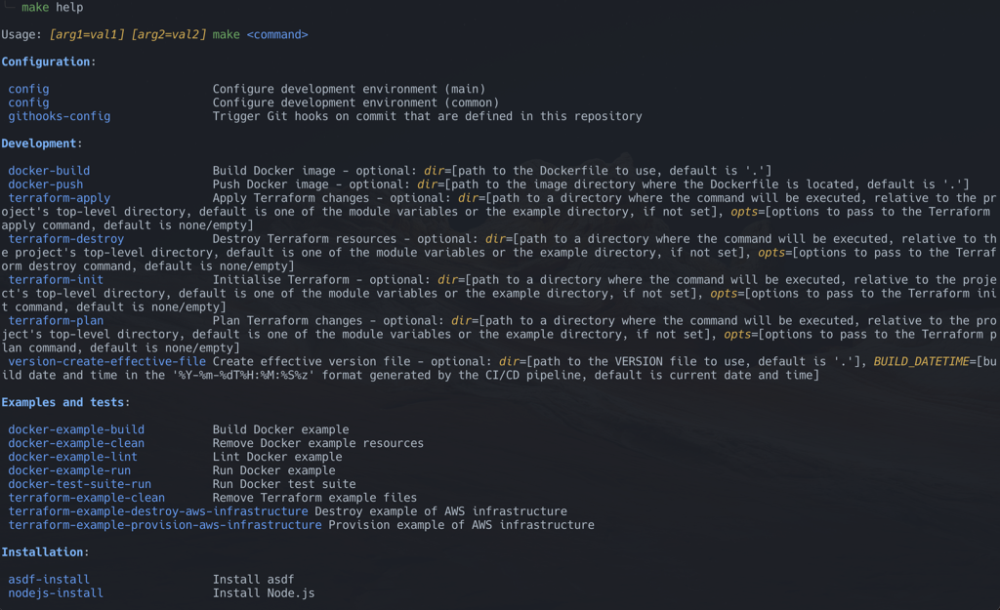

# Developer Guide: Bash and Make

- [Developer Guide: Bash and Make](#developer-guide-bash-and-make)
  - [Using Make](#using-make)
  - [Using Bash](#using-bash)
  - [Make and Bash working together](#make-and-bash-working-together)
  - [Conventions](#conventions)
    - [Debugging](#debugging)
    - [Scripts](#scripts)

## Using Make

Sample make target signature definition:

```makefile
some-target: # Target description - mandatory: foo=[description]; optional: baz=[description, default is 'qux'] @Category
    # Recipe implementation...
```

- `some-target`: This is the name of the target you would specify when you want to run this particular target. Use the kebab-case naming convention and prefix with an underscore `_` to mark it as a "private" target. The first part of the name is used for grouping, e.g. `docker-*` or `terraform-*`.
- `Target Description`: Provided directly after the target name as a single line, so be concise.
- `mandatory` parameters: Parameters that must be provided when invoking the target. Each parameter has its own description. Please follow the specified format as it is used by `make help`.
- `optional` parameters: Parameters that are not required when invoking the target. They may have a default value. Each parameter has its own description.
- `@Category` label: Used for grouping by the `make help` command.
- `Recipe implementation`: This section defines the actual commands or steps the target will execute. **Do not exceed 5 lines of effective code**. For more complex operations, use a shell script. Refer to the `docker-build` implementation in the [docker.mk](../../scripts/docker/docker.mk) file. More complex operations are implemented in the [docker.sh](../../scripts/docker/docker.lib.sh) script for readability and simplicity.

Run make target from a terminal:

```shell
foo=bar make some-target # Environment variable is passed to the make target execution process
make some-target foo=bar # Make argument is passed to the make target execution process
```

By convention we use uppercase variables for global settings that you would ordinarily associate with environment variables. We use lower-case variables as arguments to call functions or make targets, in this case.

All make targets should be added to the `${VERBOSE}.SILENT:` section of the `make` file, which prevents `make` from printing commands before executing them. The `${VERBOSE}` prefix on the `.SILENT:` special target allows toggling it if needed. If you explicitly want output from a certain line, use `echo`.

It is worth noting that by default, `make` creates a new system process to execute each line of a recipe. This is not the desired behaviour for us and the entire content of a make recipe (a target) should be run in a single shell invocation. This has been configured in this repository by setting the [`.ONESHELL:`](https://www.gnu.org/software/make/manual/html_node/One-Shell.html) special target in the `scripts/init.mk` file.

To see all available make targets, run `make help`.



## Using Bash

When working in the command-line ensure the environment variables are reset to their initial state. This can be done by reloading shell using the `env -i $SHELL` command.

Sample Bash function definition:

```shell
# Short function description
# Arguments (provided as environment variables):
#   foo=[description]
#   baz=[description, default is 'qux']
function some-shell-function() {
    # Function implementation...
```

Run Bash function from a terminal:

```shell
source scripts/a-suite-of-shell-functions
foo=bar some-shell-function # Environment variable is accessible by the function executed in the same operating system process
```

```shell
source scripts/a-suite-of-shell-functions
foo=bar
some-shell-function # Environment variable is still accessible by the function
```

Run Bash script from a terminal, bear in mind that executing a script creates a child operating system process:

```shell
# Environment variable has to be exported to be passed to a child process, DO NOT use this pattern
export foo=bar
scripts/a-shell-script
```

```shell
# or to be set in the same line before creating a new process, prefer this pattern over the previous one
foo=bar scripts/a-shell-script

# or when multiple variables are required
foo=bar \
baz=qux \
  scripts/a-shell-script
```

By convention we use uppercase variables for global settings that you would ordinarily associate with environment variables. We use lower-case variables as arguments to be passed into specific functions we call, usually on the same line, right before the function name.

The command `set -euo pipefail` is commonly used in the Bash scripts, to configure the behavior of the script in a way that makes it more robust and easier to debug. Here is a breakdown of each option switch:

- `-e`: Ensures that the script exits immediately if any command returns a non-zero exit status.
- `-u`: Makes the script exit if there is an attempt to use an uninitialised variable.
- `-o pipefail`: ensures that if any command in a pipeline fails (i.e., returns a non-zero exit status), then the entire pipeline will return that non-zero status. By default, a pipeline returns the exit status of the last command.

## Make and Bash working together

Sample make target calling a Bash function. Notice that `baz` is going to be accessible to the function as it is executed in the same operating system process:

```makefile
some-target: # Run shell function - mandatory: foo=[description]
  source scripts/a-suite-of-shell-function
  baz=qux
  some-shell-function # 'foo' and 'baz' are accessible by the function
```

Sample make target calling another make target. In this case a parameter `baz` has to be passed as a variable to the make target, which is executed in a child process:

```makefile
some-target: # Call another target - mandatory: foo=[description]
  baz=qux \
    make another-target # 'foo' and 'baz' are passed to the make target
```

Run it from a terminal:

```shell
foo=bar make some-target
```

## Conventions

### Debugging

To assist in investigating scripting issues, the `VERBOSE` variable is available for both Make and Bash scripts. If it is set to `true` or `1`, it prints all the commands that the script executes to the standard output. Here is how to use it:

for Make targets

```shell
VERBOSE=1 make docker-example-build
```

for Bash scripts

```shell
VERBOSE=1 scripts/shellscript-linter.sh
```

### Scripts

Most scripts provided with this repository template can use tools installed on your `PATH` if they are available or run them from within a Docker container. To force a script to use Docker, the `FORCE_USE_DOCKER` variable is provided. This feature allows you to use custom tooling if it is present on the command-line path. Here is how to use it:

```shell
FORCE_USE_DOCKER=1 scripts/shellscript-linter.sh
```

You can combine it with the `VERBOSE` flag to see the details of the execution flow:

```shell
VERBOSE=1 FORCE_USE_DOCKER=1 scripts/shellscript-linter.sh
```
