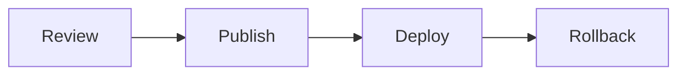
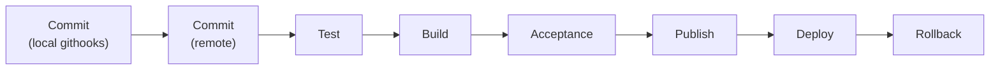
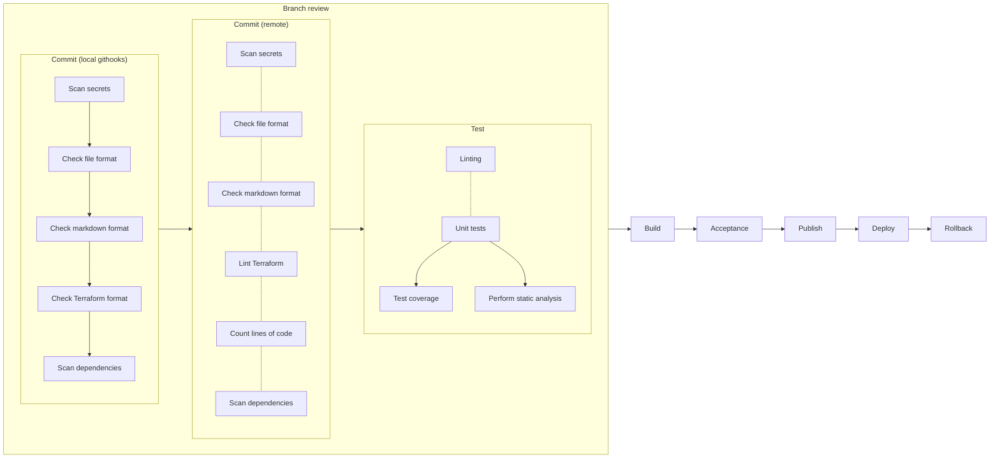
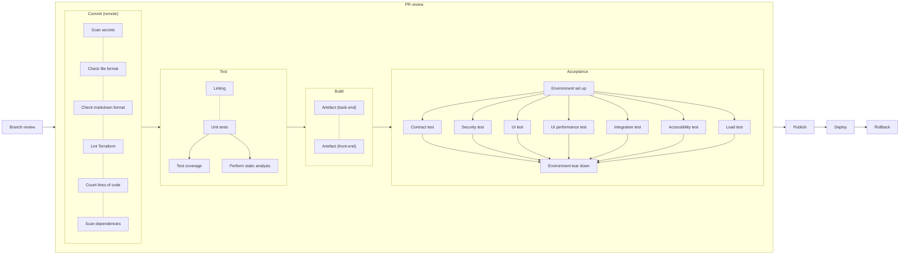
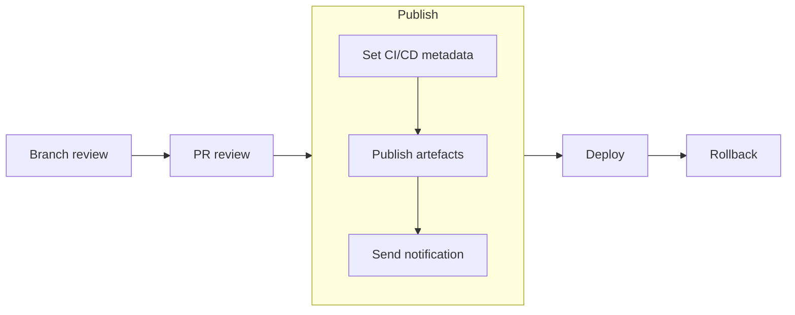
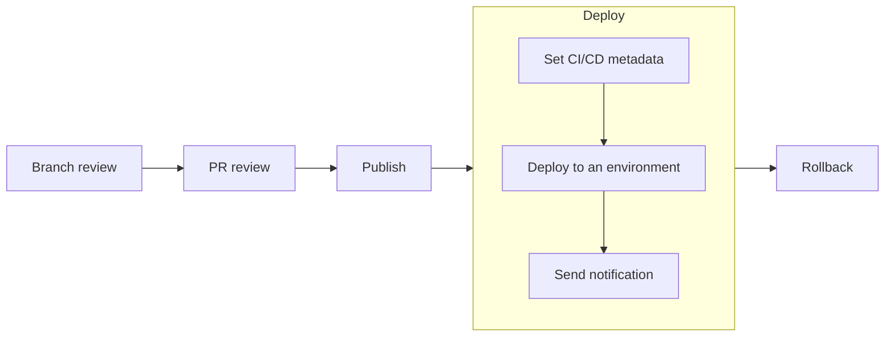
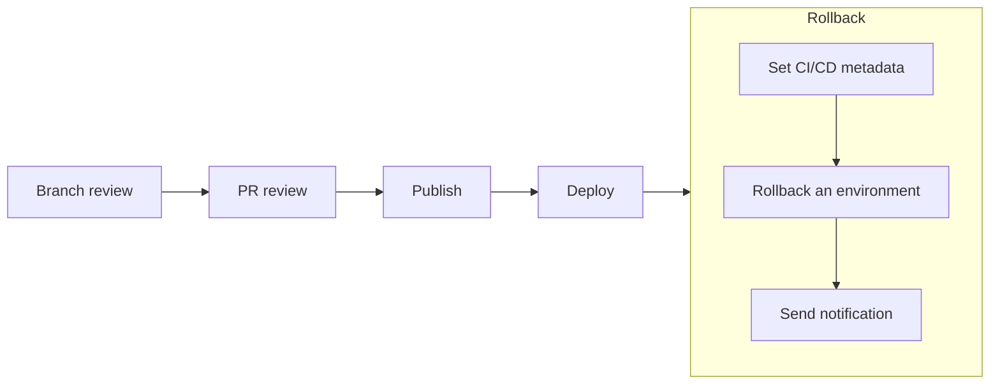
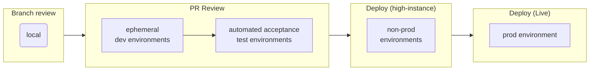

# Developer Guide: CI/CD pipeline

- [Developer Guide: CI/CD pipeline](#developer-guide-cicd-pipeline)
  - [The pipeline high-level workflow model](#the-pipeline-high-level-workflow-model)
  - [Workflow stages](#workflow-stages)
    - [End-to-end workflow stages](#end-to-end-workflow-stages)
    - [Stage triggers](#stage-triggers)
    - [Branch review workflow](#branch-review-workflow)
    - [PR review workflow](#pr-review-workflow)
    - [Publish workflow](#publish-workflow)
    - [Deploy workflow](#deploy-workflow)
    - [Rollback workflow](#rollback-workflow)
  - [Environments and artefact promotion](#environments-and-artefact-promotion)
  - [Resources](#resources)

## The pipeline high-level workflow model

## Workflow stages

### End-to-end workflow stages

### Stage triggers

| Workflow | Stage                   |    `main` branch trigger    |  Task branch trigger   |
|---------:|:------------------------|:---------------------------:|:----------------------:|
|   Review | Commit (local githooks) |              -              |       on commit        |
|   Review | Commit (remote)         |          on merge           |        on push         |
|   Review | Test                    |          on merge           |        on push         |
|   Review | Build                   |          on merge           | on push, if PR is open |
|   Review | Acceptance              |          on merge           | on push, if PR is open |
|  Publish | Publish                 |           on tag            |           -            |
|   Deploy | Deploy                  |           on tag            |           -            |
| Rollback | Rollback                | on demand or on healthcheck |           -            |

- Publish:
  - When merged, create snapshot release
  - When tagged, crate Release Candidate
- Deploy
  - Only deploy RCs
  - Deploy to specified environment

### Branch review workflow

### PR review workflow

### Publish workflow

### Deploy workflow

### Rollback workflow

## Environments and artefact promotion

## Resources

- Blog post [Going faster with continuous delivery](https://aws.amazon.com/builders-library/going-faster-with-continuous-delivery/)
- Blog post [Automating safe, hands-off deployments](https://aws.amazon.com/builders-library/automating-safe-hands-off-deployments/)
- Book [Continuous Delivery: Reliable Software Releases through Build, Test, and Deployment Automation](https://www.oreilly.com/library/view/continuous-delivery-reliable/9780321670250/)
